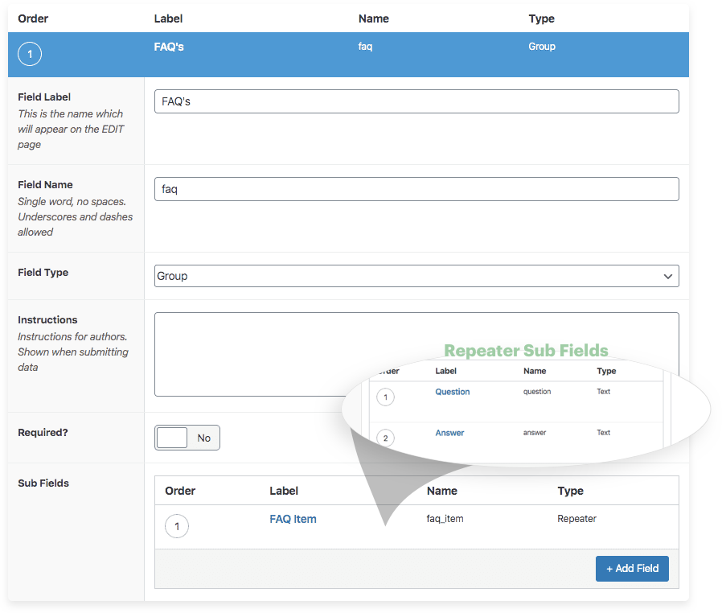

TLDR; In order to display repeater field values nested inside of a group field with Advanced Custom Fields (ACF), you will need to loop over the group field AND the repeater field.

```php
// group loop
if( have_rows('group_field_name') ) {
  while ( have_rows('group_field_name') ) { the_row();
    // repeater loop
    if( have_rows('repeater_field_name') ) {
      while ( have_rows('repeater_field_name') ) { the_row();
        // repeater sub field
        echo get_sub_field('repeater_sub_field_name');
      }
    }
  }
}
```

## Getting Started

Why use a Repeater within a Group? Well, the group field provides an easy way to structure your fields. There are also some extra advantages to using group fields as it relates to editing content. We'll save that for another post.

In order to use ACF's Repeater Field, you're going to need to get your hands on the [PRO](https://www.advancedcustomfields.com/pro/) version of Advanced Custom Fields.

### Create your Group and Repeater fields

In this example, we're just going to make a simple frequently asked questions custom field.



Based on the field names we setup in the pictures above, we could use something like the following to get it all working:

```php
// group loop
if( have_rows('faq') ) {
  while ( have_rows('faq') ) { the_row();
    // repeater loop
    if( have_rows('faq_item') ) {
      while ( have_rows('faq_item') ) { the_row();
        // vars
        $question = get_sub_field('question');
        $answer   = get_sub_field('answer');
        // sub fields
        if($question) {
          echo '<span class="question">'.$question.'</span>';
        }
        if($answer) {
          echo '<span class="answer">'.$answer.'</span>';
        }
      }
    }
  }
}
```

> Advanced Custom Fields is a WordPress plugin which allows you to add extra content fields to your WordPress edit screens. These extra content fields are more commonly referred to as Custom Fields and can allow you to build website’s faster and educate your client’s quicker.

Resource: https://www.advancedcustomfields.com/resources/group/
