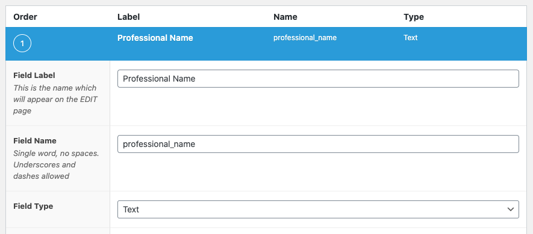
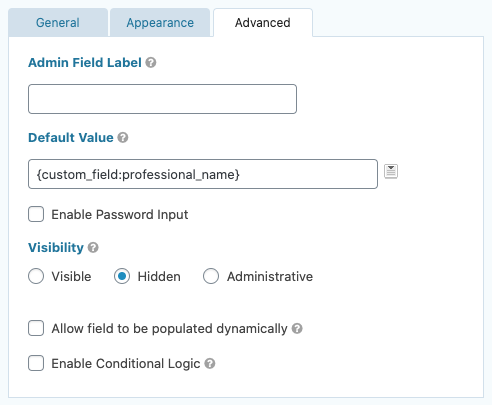

Today, I had the task of passing a dynamic value to a Gravity Forms field. In this instance, we had a profile of a professional, and the gravity form allows the visitor to request an appointment with whichever professional's profile they're viewing. However, in order to pass the information along as to which professional the form was for, a value needed to be passed to distinguish it from other professionals. At first, the [page title](https://docs.gravityforms.com/embed_post-merge-tag/) seemed like the obvious choice. Upon further thinking, this was not going to work, as this form is also used in different locations throughout the website. This is where ACF and a custom value comes in.

Hopefully it goes without saying that you will need both the Gravity Forms and Advanced Custom Fields plugin to accomplish this.

## Setting up the custom field

In this instance, [a simple text field](https://www.advancedcustomfields.com/resources/text/) will do the trick. Set up the field as you normally would.

Then assign the field to the desired template/post type/etc.

**Important** 👇👇👇

You will need to populate the field on the page that it's included on. Aside from manually, there are a number of ways to programmatically do this that I won't be going over today. One of which is passing the page title (or whatever value you desire) to the field via [update_field()](https://www.advancedcustomfields.com/resources/update_field/). In my case, I wrote a plugin that imports the information I need from an external database. Whatever way you do it, if you want the value to be passed, it needs to exist.

## Setting up the form field

In your existing (or new) form, select the "Single Line Text" field from the Standard Fields box. Click on the advanced tab.

You'll pass your custom field in the default value section. This with automatically populate this field with the ACF field value.

Breaking it down: `{custom_field:professional_name}`

We're wrapping it in curly braces because we're using [merge tags](https://docs.gravityforms.com/category/user-guides/merge-tags-getting-started/), more specifically, the [custom field merge tag](https://docs.gravityforms.com/custom-field-merge-tags/). So, `custom_field` indicates what type of merge tag we're using, and `professional_name` is the custom field associated with the page or component.

From there, since in my example this is really for administration use, I went ahead and set the gravity form field to hidden, as there is no reason for the end user to see this field. This is entirely dependent on your situation.

**That's all folks.** You can view the resources below for additional information on Merge Tags.

https://docs.gravityforms.com/category/user-guides/merge-tags-getting-started/  
https://docs.gravityforms.com/custom-field-merge-tags/
